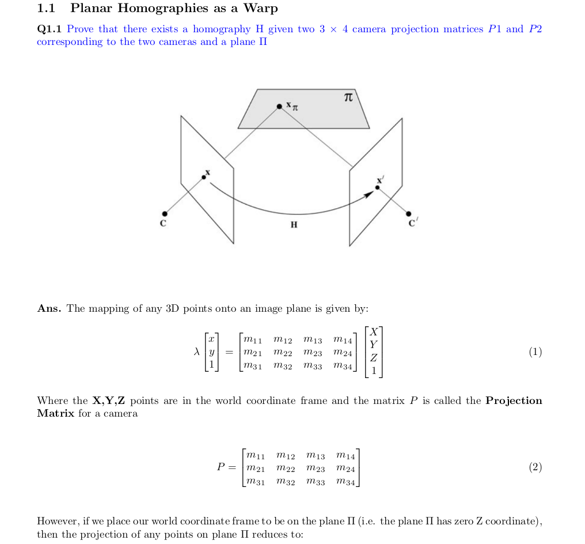

  

    Table of contents
  

  {: .text-delta }
1. TOC
{:toc}

# Before you Begin
{: .fs-9 }

[Reference Book 1](https://drive.google.com/file/d/1jqEB739EfifhSyiCK6vdbPIz7gX9Ywmr/view?usp=sharing){: .btn .fs-5 .mb-4 .mb-md-0 }
[Reference Book 2](https://drive.google.com/file/d/1Kn6dilDeR_7leIctuVa87-czuqBoxJh-/view?usp=sharing){: .btn .fs-5 .mb-4 .mb-md-0 }

# PDFs

[Assignment Writeup](https://github.com/sushanthj/assignments_F22/blob/main/CV_A/Assignment_3/hw3_f22.pdf)
[My Answers](https://github.com/sushanthj/assignments_F22/blob/main/CV_A/Assignment_3/sushantj_hw3.pdf)

# Understanding Planar Homography

